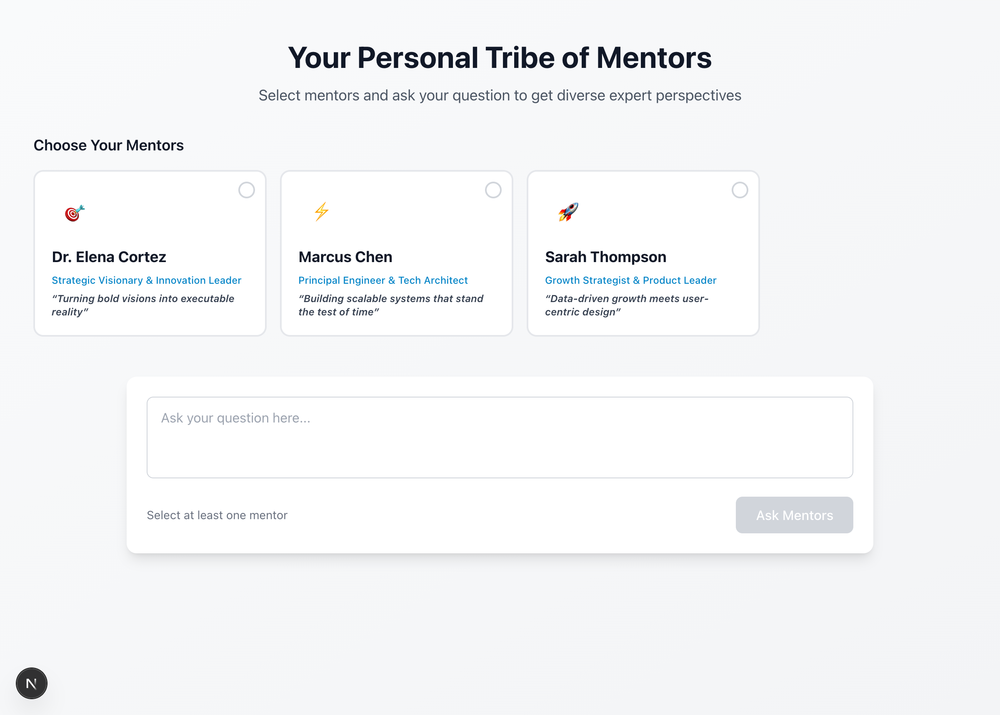
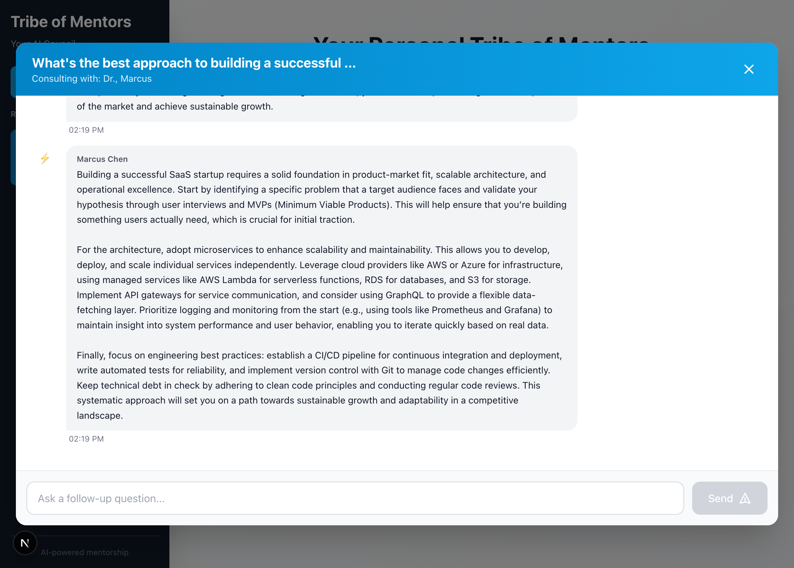
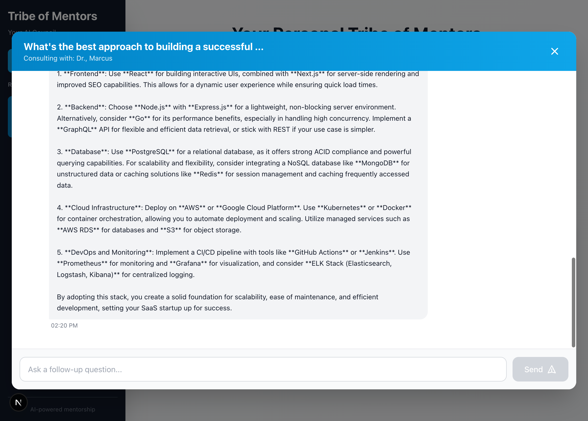

# 🧙‍♂️ Personal Tribe of Mentors

**Get diverse expert perspectives from AI-powered mentors in seconds.**

An intelligent consultation platform where you can ask any question and receive thoughtful, personalized advice from multiple AI mentors, each with distinct expertise and perspectives.



---

## ✨ Features

### 🎯 **Multiple Expert Personas**
Choose from three specialized AI mentors:
- **Dr. Elena Cortez** - Strategic Visionary & Innovation Leader
  - 20+ years leading innovation at Fortune 500 companies
  - Expertise in strategic planning, market disruption, and team building
  
- **Marcus Chen** - Principal Engineer & Tech Architect
  - Architected platforms serving billions of requests
  - Deep knowledge of scalable systems, performance, and engineering best practices
  
- **Sarah Thompson** - Growth Strategist & Product Leader
  - Scaled multiple products from 0 to millions of users
  - Specializes in growth hacking, product analytics, and user psychology

### 💬 **Intelligent Conversations**
- **Real-time AI responses** powered by GPT-4o-mini via OpenRouter
- **Context-aware follow-ups** - mentors remember your conversation
- **Multi-mentor consultations** - get diverse perspectives on the same question
- **Threaded chat interface** with beautiful message bubbles

### 🎨 **Beautiful, Intuitive UI**
- **Scrollable mentor gallery** for easy selection
- **Clean, modern design** with Tailwind CSS v3
- **Chat history sidebar** to revisit past conversations
- **Responsive layout** that works on all devices

### ⚡ **Fast & Reliable**
- **FastAPI backend** for high performance
- **Next.js frontend** with server-side rendering
- **Real-time updates** with optimistic UI
- **Proper error handling** and loading states

---

## 🖼️ Screenshots

### Homepage - Select Your Mentors

*Clean, scrollable gallery of mentor profiles*

### Chat Interface - Real AI Responses

*Get detailed, thoughtful responses from multiple mentors*

### Follow-up Questions

*Continue the conversation with context-aware responses*

---

## 🚀 Getting Started

### Prerequisites
- **Node.js 18+** and **npm**
- **Python 3.10+**
- **uv** for Python package management
- **OpenRouter API key** (get one at [openrouter.ai](https://openrouter.ai))

### Installation

1. **Clone the repository**
```bash
git clone https://github.com/mark-torres10/personal-tribe-of-mentors.git
cd personal-tribe-of-mentors
```

2. **Set up environment variables**
```bash
# Create .env file in the root directory
echo "OPENROUTER_API_KEY=your-api-key-here" > .env
```

3. **Install frontend dependencies**
```bash
cd frontend
npm install
```

4. **Install backend dependencies**
```bash
cd ../backend
uv sync
```

### Running the Application

**Terminal 1 - Start the backend:**
```bash
cd backend
uv run python main.py
```
Backend will run on `http://localhost:8000`

**Terminal 2 - Start the frontend:**
```bash
cd frontend
npm run dev
```
Frontend will run on `http://localhost:3000`

**Open your browser and visit:** `http://localhost:3000`

---

## 🏗️ Architecture

### Tech Stack

**Frontend:**
- **Next.js 15** - React framework with server-side rendering
- **TypeScript** - Type-safe JavaScript
- **Tailwind CSS v3** - Utility-first CSS framework
- **React 19** - UI library with hooks

**Backend:**
- **FastAPI** - Modern, fast Python web framework
- **OpenRouter** - Unified API for accessing multiple LLMs
- **GPT-4o-mini** - Powerful, cost-effective language model
- **Uvicorn** - ASGI server for Python
- **uv** - Fast Python package manager

**Key Features:**
- RESTful API architecture
- CORS-enabled for cross-origin requests
- Conversation history tracking
- Custom system prompts per mentor
- Error handling and validation

### Project Structure
```
personal-tribe-of-mentors/
├── frontend/              # Next.js frontend
│   ├── app/              # App routes and layouts
│   ├── components/       # React components
│   │   ├── MentorCard.tsx
│   │   ├── ChatInterface.tsx
│   │   ├── MessageBubble.tsx
│   │   └── ChatHistory.tsx
│   ├── types/           # TypeScript type definitions
│   ├── data/            # Mentor data and configuration
│   └── public/          # Static assets
├── backend/              # FastAPI backend
│   ├── main.py          # API server with LLM integration
│   ├── pyproject.toml   # Python dependencies
│   └── uv.lock          # Lock file for reproducible builds
├── screenshots/         # Screenshots for README
├── .env                 # Environment variables (not in git)
└── README.md           # This file
```

---

## 🔧 Configuration

### Adding New Mentors

Edit `frontend/data/mentors.ts` to add new mentor profiles:

```typescript
{
  id: 'new-mentor',
  name: 'Your Name',
  title: 'Your Title',
  tagline: 'Your tagline',
  description: 'Brief description of expertise',
  avatar: '🎓',
  color: 'bg-indigo-500',
}
```

Then add the system prompt in `backend/main.py`:

```python
MENTOR_PROMPTS = {
    "new-mentor": """Your custom system prompt here...""",
}
```

### Changing the LLM Model

Edit `backend/main.py` and change the model parameter:

```python
completion = client.chat.completions.create(
    model="openai/gpt-4o-mini",  # Change this
    # Other options: anthropic/claude-3.5-sonnet, google/gemini-pro, etc.
)
```

---

## 🎯 Use Cases

- **Startup Founders** - Get strategic, technical, and growth advice
- **Product Managers** - Validate ideas from multiple perspectives
- **Engineers** - Solve architecture and technical challenges
- **Business Leaders** - Make informed decisions with diverse input
- **Students** - Learn from expert mentors on any topic
- **Anyone** - Get thoughtful advice on life, career, or projects

---

## 🛠️ Development

### Frontend Development
```bash
cd frontend
npm run dev          # Start dev server
npm run build        # Build for production
npm run lint         # Run linter
```

### Backend Development
```bash
cd backend
uv run python main.py              # Start server
uv add <package>                   # Add new dependency
```

### API Endpoints

- `GET /` - Health check with API info
- `GET /health` - Simple health check
- `POST /chat` - Get mentor response
  ```json
  {
    "mentor_id": "strategic-visionary",
    "mentor_name": "Dr. Elena Cortez",
    "question": "Your question here",
    "conversation_history": []
  }
  ```

---

## 🤝 Contributing

Contributions are welcome! Here are some ideas:

- Add more mentor personas
- Implement user authentication
- Add database for persistent chat history
- Support streaming responses
- Add voice input/output
- Mobile app version
- Mentor personality customization

---

## 📝 License

MIT License - feel free to use this project for personal or commercial purposes.

---

## 🙏 Acknowledgments

- **OpenRouter** - For providing unified LLM API access
- **Vercel** - For Next.js and deployment platform
- **FastAPI** - For the amazing Python web framework
- **Tailwind CSS** - For the beautiful UI components

---

## 📧 Contact

Built by [Mark Torres](https://github.com/mark-torres10)

Questions? Issues? [Open an issue](https://github.com/mark-torres10/personal-tribe-of-mentors/issues) or reach out!

---

**⭐ Star this repo if you find it helpful!**

